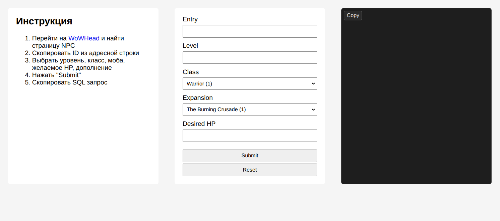

# WoW NPC Modifier

[](https://github.com/fey/wow-npc-modifier/actions/workflows/github-pages.yml)

App for editing WoW creature template data in the browser.

Live demo [https://fey.github.io/wow-npc-modifier/](https://fey.github.io/wow-npc-modifier/)



## Prerequisites

* Unix (Mac, Linux, WSL)
* Git
* Node.JS 24+

## Commands

See [Makefile](./Makefile)

```bash
make install
make start
```

## Deploy

GitHub Actions builds the project on every push and pull request. Deployment to GitHub Pages runs only when changes are pushed to `main`.
